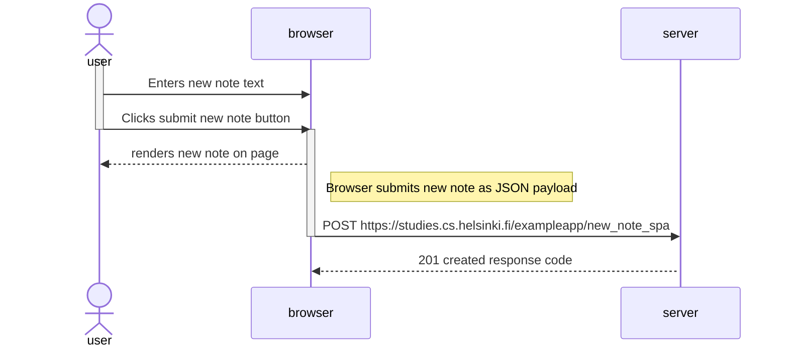

```mermaid
sequenceDiagram
    actor user
    participant browser
    participant server

    activate user
    user->>browser: Enters new note text
    user->>browser: Clicks submit new note button
    deactivate user

    activate browser
    browser-->>user: renders new note on page
    Note right of browser: Browser submits new note as JSON payload
    browser->>server: POST https://studies.cs.helsinki.fi/exampleapp/new_note_spa
    deactivate browser
    activate server
    server-->>browser: 201 created response code

```