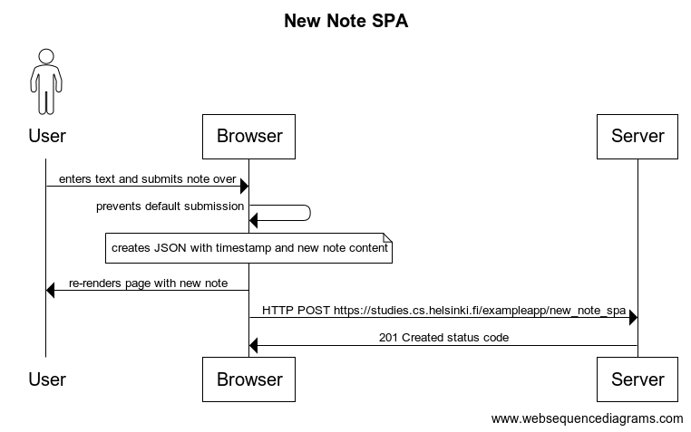

# Exercise 0.6 - New Note - Single Page App

My diagram showing what happens when a user submits a new note in the single page app is as follows:

Additionally, the diagram can be viewed on [websequencediagrams](https://www.websequencediagrams.com/?lz=dGl0bGUgTmV3IE5vdGUgU1BBCgphY3RvciBVc2VyCgpVc2VyLT5Ccm93c2VyOiBlbnRlcnMgdGV4dCBhbmQgc3VibWl0cyBub3RlIG92ZXIKACQHACkLcHJldmVudHMgZGVmYXVsdAAvBnNzaW9uCgAvCSAAWgljcmVhdGVzIEpTT04gd2l0aCB0aW1lc3RhbXAAbgVuZXcAaQZjb250ZW50AGgKVQCBHgVyZS1yZW5kZXJzIHBhZ2UAPQYALQgAgRUKU2VydmVyOiBIVFRQIFBPU1QgaHR0cHM6Ly9zdHVkaWVzLmNzLmhlbHNpbmtpLmZpL2V4YW1wbGVhcHAvbmV3X25vdGVfc3BhCgBDBgCCGQsyMDEgQwCBQAVkIHN0YXR1cyBjb2Rl&s=default).
